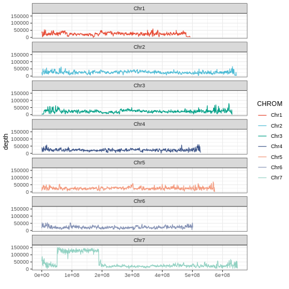
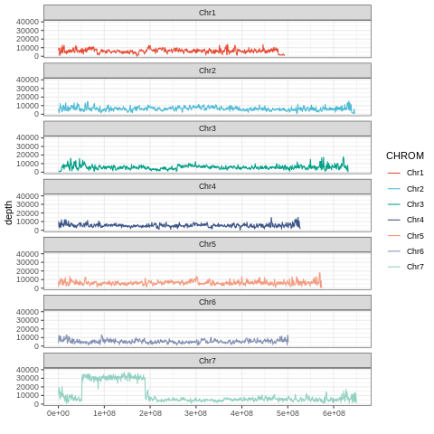
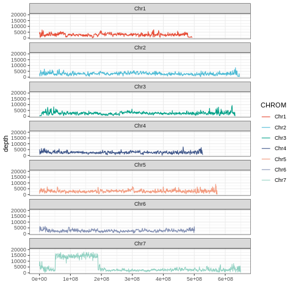

# Introgression region detecting and tracking

In this document, I will detect the introgression region from KF21 (wheat Zhou18 X <i>Aegilops tauschii</i> T015) as an example.

Available methods

1. Low depth (<1X) resequencing data k-mer (Recommend)
2. High depth (>10X) resequencing data mapping
3. Low depth (<1X) resequencing data mapping
4. exon capture (on the way)

## prepare-data

1. Partent1 <i>Aegilops tauschii</i> T015 sequencing raw data (depth > 10X) and SNP data sets
2. Partent2 wheat Zhou18 sequencing raw data (depth > 10X) and SNP data sets
3. KF21 sequencing raw data
   1. whole sequencing raw data. > 5X
   2. extract subset 1X, 0.1X, 0.2X

## Method 1. Low depth resequencing data k-mer

This is an alignment-free method to detect introgression fragment.

1. Step1: count each sample k-mer
   Use the parameter "-ci1" to contain all k-mer
2. Step2: Generate KF21 k-mer dataset for detect introgression fragments
   1. Compare parent1 T015 and parent2 Zhou18 k-mer dataset, only remain T015 special k-mer.
   Using the parameter "-ci3" to ignore low-frequency k-mer, which may be caused by sequencing error
   2. Compare KF21 k-mer to "T015 special k-mer", only remain common k-mer
3. Step3: The introgression fragment is determined according to the k-mer distribution density at the chromosome

- Benchmark

| Dataset                 | Software       | Usage         | Data size (Gb) | CPU time (sec.) | Max Memory (Mb) | threads | Run time (sec.) |
| ----------------------- | -------------- | ------------- | -------------- | --------------- | --------------- | ------- | --------------- |
| KF21 (0.1X)             | KMC3/kmc       | k-mer matrix  | 1.5            | 211.61          | 25213           | 38      | 33              |
| KF21 (0.2X)             | KMC3/kmc       | k-mer matrix  | 3.3            | 305.95          | 35550           | 38      | 63              |
| KF21 (1X)               | KMC3/kmc       | k-mer matrix  | 16             | 1391.37         | 45264           | 38      | 210             |
| T015                    | KMC3/kmc       | k-mer matrix  | 115            | 11583.54        | 75530           | 38      | 1372            |
| Zhou18                  | KMC3/kmc       | k-mer matrix  | 107            | 11691.82        | 76187           | 38      | 1167            |
| T015-Zhou18             | KMC3/kmc_tools | special k-mer | -              | 2667.51         | 11301           | 38      | 7622            |
| T015-Zhou18-KF21 (0.1X) | KMC3/kmc_tools | special k-mer | -              | 243.55          | 2906            | 38      | 317             |
| T015-Zhou18-KF21 (0.2X) | KMC3/kmc_tools | special k-mer | -              | 478.82          | 3489            | 38      | 596             |
| T015-Zhou18-KF21 (1X)   | KMC3/kmc_tools | special k-mer | -              | 1100.86         | 3775            | 38      | 2442            |
| T015-Zhou18-KF21 (0.1X) | custom script  | k-mer locus   | -              | 8612.44         | 21240           | 38      | 241             |
| T015-Zhou18-KF21 (0.2X) | custom script  | k-mer locus   | -              | 15557.39        | 21195           | 38      | 415             |
| T015-Zhou18-KF21 (1X)   | custom script  | k-mer locus   | -              | 62510.59        | 21344           | 38      | 1619            |

```sh
base_dir=/cluster/home/baishenglong/AeT093_project/results/89.introgression_region_detect
mkdir -p $base_dir/introgression-kmer
cd $base_dir/introgression-kmer

mkdir -p $base_dir/introgression-kmer/00.prepare-data
cd $base_dir/introgression-kmer/00.prepare-data

ln -s /share/home/baishenglong/Ae_Pan_Geneome/data/01.Illumina_DNA/06.T015/PE150_add/clean_data/T015-1_HCTCFALXX_L3_1.clean.fq.gz ./T015_1.fq.gz
ln -s /share/home/baishenglong/Ae_Pan_Geneome/data/01.Illumina_DNA/06.T015/PE150_add/clean_data/T015-1_HCTCFALXX_L3_2.clean.fq.gz ./T015_2.fq.gz
ln -s /cluster/home/baishenglong/-/results/20200119-extract-introgression-reseq/raw_db/Zhou18_1.fq.gz ./Zhou18_1.fq.gz
ln -s /cluster/home/baishenglong/-/results/20200119-extract-introgression-reseq/raw_db/Zhou18_2.fq.gz ./Zhou18_2.fq.gz

read1=/cluster/home/baishenglong/AeT093_project/results/80.KF21/00.raw_data/2020-BC/Clean/6-1-3/V300075181_L1_WHEilaRAAAA-683_1.fq.gz
read2=/cluster/home/baishenglong/AeT093_project/results/80.KF21/00.raw_data/2020-BC/Clean/6-1-3/V300075181_L1_WHEilaRAAAA-683_2.fq.gz
# 0.1X --> 16000000000*0.1/150(read length)/2(read1 read2) = 5300000
bsubt "seqtk sample -s100 $read1 5000000 | gzip > KF21BC-5Mreads_1.fq.gz"
bsubt "seqtk sample -s100 $read2 5000000 | gzip > KF21BC-5Mreads_2.fq.gz"
# 0.2X --> 16000000000*0.2/150(read length)/2(read1 read2) = 10600000
bsubt "seqtk sample -s100 $read1 11000000 | gzip > KF21BC-11Mreads_1.fq.gz"
bsubt "seqtk sample -s100 $read2 11000000 | gzip > KF21BC-11Mreads_2.fq.gz"
# 1X --> 16000000000*1/150(read length)/2(read1 read2) = 53000000
bsubt "seqtk sample -s100 $read1 53000000 | gzip > KF21BC-53Mreads_1.fq.gz"
bsubt "seqtk sample -s100 $read2 53000000 | gzip > KF21BC-53Mreads_2.fq.gz"

# Step1: count each sample k-mer
mkdir -p $base_dir/introgression-kmer/01.kmer-freq-count
cd $base_dir/introgression-kmer/01.kmer-freq-count

for read1 in `ls ../00.prepare-data/*_1.fq.gz`;do 
  kmer=96
  thread=38
  sample_name=$(basename $read1 | cut -d '_' -f1)
  read2=$(echo $read1 | sed 's/_1.fq.gz/_2.fq.gz/g')
  mkdir $sample_name
  echo -e "$read1\n$read2" > $sample_name/sample.list
  bsubt -q normalB -n ${thread} "mkdir $sample_name/${sample_name}.k${kmer}.tmp; /cluster/home/baishenglong/softwares/KMC3/kmc -fq -k$kmer -t${thread} -m80 -ci1 @$sample_name/sample.list $sample_name/${sample_name}.k${kmer}_reads.jf $sample_name/${sample_name}.k${kmer}.tmp && rm -r $sample_name/${sample_name}.k${kmer}.tmp"
done

# Step2: Generate KF21 kmer dataset for detect introgression fragments
mkdir -p $base_dir/introgression-kmer/02.merge-kmer-freq
cd $base_dir/introgression-kmer/02.merge-kmer-freq

# parent unique kmer
parent1=T015
parent2=Zhou18
thread=38
bsubt -J unique-kmer -n ${thread} "/cluster/home/baishenglong/softwares/KMC3/kmc_tools -t${thread} simple ../01.kmer-freq-count/${parent1}/${parent1}.k96_reads.jf -ci3 ../01.kmer-freq-count/${parent2}/${parent2}.k96_reads.jf -ci3 kmers_subtract ${parent1}.k96.unique.jf"
# bsubt -J unique-kmer -n ${thread} "/cluster/home/baishenglong/softwares/KMC3/kmc_tools -t${thread} simple ../01.kmer-freq-count/${parent1}/${parent1}.k96_reads.jf -ci3 ../01.kmer-freq-count/${parent2}/${parent2}.k96_reads.jf -ci3 reverse_kmers_subtract ${parent2}.k96.unique.jf"

# population unique kmer
for read1 in `ls ../00.prepare-data/*_1.fq.gz | egrep -v "$parent1|$parent2"`;do 
  sample_name=$(basename $read1 | cut -d '_' -f1)
  bsubt -w 328452 -J unique-kmer -n ${thread} "/cluster/home/baishenglong/softwares/KMC3/kmc_tools -t${thread} simple ${parent1}.k${kmer}.unique.jf ../01.kmer-freq-count/${sample_name}/${sample_name}.k${kmer}_reads.jf intersect ${parent1}.${sample_name}.k${kmer}.unique.jf && /cluster/home/baishenglong/softwares/KMC3/kmc_tools -t${thread} transform ${parent1}.${sample_name}.k${kmer}.unique.jf dump ${parent1}.${sample_name}.k${kmer}.unique.dump"
done

# Step3: k-mer at genome locus
mkdir -p $base_dir/introgression-kmer/03.kmer-locus
cd $base_dir/introgression-kmer/03.kmer-locus

reference=/cluster/home/baishenglong/Ae_T093/101.novogene/final_genome_anno/assembly/Ae_T093.genome.fa
genome_windows=/cluster/home/baishenglong/Ae_T093/101.novogene/final_genome_anno/assembly/Ae_T093_windows1M_step500k.bed
for read1 in `ls ../00.prepare-data/*_1.fq.gz | egrep -v "$parent1|$parent2"`;do 
  sample_name=$(basename $read1 | cut -d '_' -f1)
  # convert to fasta
  bsubt -n $thread "number=0; cut -f 1 ../02.merge-kmer-freq/${parent1}.${sample_name}.k${kmer}.unique.dump | awk '{number += 1; print \">kmer\"number\"\n\"\$1}' | pigz -p 8 > ${parent1}.${sample_name}.k${kmer}.unique.kmer.fa.gz" 1>$sample_name.jobid; sleep 1
  # bwa / blast
  jobid=$(cat $sample_name.jobid | cut -d '<' -f 2 | cut -d '>' -f 1)
#   bsubt -q normalB -n 38 -w $jobid "zcat ${parent1}.${sample_name}.k${kmer}.unique.kmer.fa.gz | parallel --noswap -j 80% --block 10k --recstart '>' --pipe blastn -outfmt 6 -db $reference -evalue 10 -word_size 45 -num_alignments 3 -query - ｜ awk '\$3==100&&\$4==$kmer' > ${parent1}.${sample_name}.k${kmer}.unique.kmer.blast" >jobid
  bsubt -w $jobid -n $thread "bwa mem -k 45 -M -Y -t $thread $reference ${parent1}.${sample_name}.k${kmer}.unique.kmer.fa.gz | grep -v -e 'XA:Z:' -e 'SA:Z:' | grep 'MD:Z:96' | cut -f 1,3,4 > ${parent1}.${sample_name}.k${kmer}.unique.kmer.locus.tsv" 1>jobid; sleep 1
  # convert bed file
  jobid=$(cat jobid | cut -d '<' -f 2 | cut -d '>' -f 1)
  bsubt -w $jobid "sort -k2,2 -k3,3n ${parent1}.${sample_name}.k${kmer}.unique.kmer.locus.tsv | awk '{print \$2\"\t\"\$3\"\t\"\$3+1}' > ${parent1}.${sample_name}.k${kmer}.unique.kmer.locus.sort.bed" 1>jobid; sleep 1
  # plot snp-distrubtion
  jobid=$(cat jobid | cut -d '<' -f 2 | cut -d '>' -f 1)
  bsubt -w $jobid "bedtools coverage -a $genome_windows -b ${parent1}.${sample_name}.k${kmer}.unique.kmer.locus.sort.bed -counts | grep '^Chr' > ${parent1}.${sample_name}.k${kmer}.snp-distubtion.tsv && Rscript SNP_distrubtion.R ${parent1}.${sample_name}.k${kmer}.snp-distubtion.tsv ${parent1}.${sample_name}.k${kmer}.snp-distubtion.png 30000"
done

# reference=/cluster/home/baishenglong/Ae_T093/101.novogene/final_genome_anno/assembly/Ae_T093.genome.fa
# bsubt -q fatB "python ../fasta-kmer-split.py --input_genome $reference --input_kmer $kmer > genome.kmer.db"

```

- KF21 depth 1X introgression region detection



- KF21 depth 0.2X introgression region detection


- KF21 depth 0.1X introgression region detection


## Method 2. High depth (>10X) resequencing data mapping

Reference step:

1. Using [GATK pipeline](https://gatk.broadinstitute.org/hc/en-us/articles/360035535932-Germline-short-variant-discovery-SNPs-Indels-) to get KF21 SNPs data
2. Compare KF21 SNPs with Zhou18 and T015, remain KF21 same with T015 and different with Zhou18 SNPs data
3. Using 1 Mb windows and 500 kb steps to plot KF21, Zhou18 and T015 SNP distrubtion at each chromosome
4. Introgression region at KF21 SNP peak locus

## Method 3. Low depth (<1X) resequencing data mapping

[Huang et al., 2009, Genome research](https://genome.cshlp.org/content/19/6/1068.full) and [Xie et al., 2010, PNAS](https://www.pnas.org/content/107/23/10578.long) introduced the method of using low-depth resequencing data to genotype the population, respectively. Recently, [Zhao et al, 2020, Plant Methods](https://plantmethods.biomedcentral.com/articles/10.1186/s13007-020-00615-3) completed the QTL mapping of the maize RIL population using a similar method. These methods can also be applied to the detection and tracking of introgression fragments.

<!-- 
```sh
Reference step:

1. Using [samtools-mpileup pipeline](http://www.htslib.org/doc/samtools-mpileup.html) to get KF21 SNPs data
2. Compare KF21 SNPs with Zhou18 and T015, remain KF21 same with T015 and different with Zhou18 SNPs data
3. Using 1 Mb windows and 500 kb steps to plot KF21, Zhou18 and T015 SNP distrubtion at each chromosome
4. Introgression region at KF21 SNP peak locus

mkdir -p $base_dir/02.low_depth_resequencing_bwa_samtools
cd $base_dir/02.low_depth_resequencing_bwa_samtools

sample=KF21
threads=38
ref=/cluster/home/baishenglong/AeT093_project/results/80.KF21//2020-BC/01.snp_calling/KF21BC/01.reference_file/wheatCS_part.fa
read1=$base_dir/00.prepare-data/KF21BC-11Mreads_1.fq.gz
read2=$base_dir/00.prepare-data/KF21BC-11Mreads_2.fq.gz

bsubt -n $threads "bwa mem -M -Y -R \"@RG\tID:$sample\tPL:HiSeq\tPU:ILLUMINA\tLB:$sample\tSM:$sample\" -t $threads $ref $read1 $read2 | samtools sort > KF21BC-11Mreads.sort.bam"

bsubt -w 327520 "samtools index KF21BC-11Mreads.sort.bam && samtools mpileup -uf $ref KF21BC-11Mreads.sort.bam | bcftools call -mv | bgzip > variants.raw.vcf.gz && tabix -p vcf variants.raw.vcf.gz"
bsubt "bcftools filter -s LowQual -e '%QUAL<20 || DP>100' variants.raw.vcf.gz | egrep '^#|PASS' > var.flt.vcf"

# merge vcf
parent1_bam=/cluster/home/baishenglong/AeT093_project/results/80.KF21/2020-BC/01.snp_calling/Z18/merge_bams/Z18.sorted.bam
parent2_bam=/cluster/home/baishenglong/AeT093_project/results/41.Illumina_DNA_remap/Aet_T015_reads_vs_wheat_CS_genome/merge_bams/T015.sorted.bam
child1_bam=KF21BC-11Mreads.sort.bam
bsubt -q rackB  "bcftools mpileup -f $ref $parent1_bam $parent2_bam $child1_bam | bcftools call -mv | bgzip > all.var.raw.vcf.gz && tabix -p vcf all.var.raw.vcf.gz"
bsubt -w 328403 "bcftools filter -s LowQual -e '%QUAL<20 || DP>100' all.var.raw.vcf.gz | egrep '^#|PASS' > all.var.flt.vcf"

# 还原vcf位置
ref=/cluster/home/baishenglong/database/Triticum_aestivum/iwgsc_refseqv1.0/iwgsc_refseqv1.0_all_chromosomes_part_version/wheatCS_part.fa
bsubt -w 84193  "python2 /cluster/home/baishenglong/softwares/my_script/genome-analysis/21.split_large_genome/resume_vcf_base_fai.py merge.snp.filter.vcf.gz $ref.fai > merge.resume.snp.vcf && pigz merge.resume.snp.vcf"
bsubt -w 84194 "python2 /cluster/home/baishenglong/softwares/my_script/genome-analysis/21.split_large_genome/resume_vcf_base_fai.py merge.indel.filter.vcf.gz $ref.fai > merge.resume.indel.vcf && pigz merge.resume.indel.vcf"

mkdir -p $base_dir/2020-BC/03.vcf-compare
cd $base_dir/2020-BC/03.vcf-compare
# snp
bsubt "python2 compair_three_col_GT.py --input_vcf_gz ../02.vcf-merge-KF21BC-Z18-T015/merge.resume.snp.vcf.gz --input_same2col 9,11 --input_diff1col 10 > KF21BC-Z18-same.snp.vcf"
bsubt "python2 compair_three_col_GT.py --input_vcf_gz ../02.vcf-merge-KF21BC-Z18-T015/merge.resume.snp.vcf.gz --input_same2col 9,10 --input_diff1col 11 > KF21BC-T015-same.snp.vcf"
bsubt "python2 compair_three_col_GT.py --input_vcf_gz ../02.vcf-merge-KF21BC-Z18-T015/merge.resume.snp.vcf.gz --input_same2col 9,9 --input_diff1col 11 > KF21BC-Z18-diff.ignore-T015.snp.vcf"
# indel
bsubt "python2 compair_three_col_GT.py --input_vcf_gz ../02.vcf-merge-KF21BC-Z18-T015/merge.resume.indel.vcf.gz --input_same2col 9,11 --input_diff1col 10 > KF21BC-Z18-same.indel.vcf"
bsubt "python2 compair_three_col_GT.py --input_vcf_gz ../02.vcf-merge-KF21BC-Z18-T015/merge.resume.indel.vcf.gz --input_same2col 9,10 --input_diff1col 11 > KF21BC-T015-same.indel.vcf"
bsubt "python2 compair_three_col_GT.py --input_vcf_gz ../02.vcf-merge-KF21BC-Z18-T015/merge.resume.indel.vcf.gz --input_same2col 9,9 --input_diff1col 11 > KF21BC-Z18-diff.ignore-T015.indel.vcf"

# 只保留 0/0 1/1 类型的变异
bsubt "python2 compair_three_col_GT_only_remain_homozygous.py --input_vcf_gz ../02.vcf-merge-KF21BC-Z18-T015/merge.resume.snp.vcf.gz --input_same2col 9,11 --input_diff1col 10 > KF21BC-Z18-same.homo.snp.vcf"
bsubt "python2 compair_three_col_GT_only_remain_homozygous.py --input_vcf_gz ../02.vcf-merge-KF21BC-Z18-T015/merge.resume.snp.vcf.gz --input_same2col 9,10 --input_diff1col 11 > KF21BC-T015-same.homo.snp.vcf"
bsubt "python2 compair_three_col_GT_only_remain_homozygous.py --input_vcf_gz ../02.vcf-merge-KF21BC-Z18-T015/merge.resume.snp.vcf.gz --input_same2col 9,9 --input_diff1col 11 > KF21BC-Z18-diff.ignore-T015.homo.snp.vcf"

mkdir -p $base_dir/2020-BC/04.introgress-fragment
cd $base_dir/2020-BC/04.introgress-fragment

ln -s /cluster/home/baishenglong/database/Triticum_aestivum/iwgsc_refseqv1.0/iwgsc_refseqv1.0_all_chromosomes/161010_Chinese_Spring_v1.0_pseudomolecules.fasta_windows1M_step500k.bed ./wheatCS_windows.bed

bsubt "zcat ../02.vcf-merge-KF21BC-Z18-T015/merge.resume.snp.vcf.gz | grep 'PASS' | ~/.conda/envs/py2/bin/vcf2bed.py > all.resume.snp.bed"
bsubt "cat ../03.vcf-compare/KF21BC-Z18-same.snp.vcf | ~/.conda/envs/py2/bin/vcf2bed.py > KF21BC-Z18-same.resume.snp.bed"
bsubt "cat ../03.vcf-compare/KF21BC-T015-same.snp.vcf | ~/.conda/envs/py2/bin/vcf2bed.py > KF21BC-T015-same.resume.snp.bed"
bsubt "cat ../03.vcf-compare/KF21BC-Z18-diff.ignore-T015.snp.vcf | ~/.conda/envs/py2/bin/vcf2bed.py > KF21BC-Z18-diff.ignore-T015.resume.snp.bed"

bsubt "bedtools coverage -a wheatCS_windows.bed -b all.resume.snp.bed -counts -sorted > all.resume.snp_distribution.tsv"
bsubt "bedtools coverage -a wheatCS_windows.bed -b KF21BC-Z18-same.resume.snp.bed -counts -sorted > KF21BC-Z18-same.resume.snp_distribution.tsv"
bsubt "bedtools coverage -a wheatCS_windows.bed -b KF21BC-T015-same.resume.snp.bed -counts -sorted > KF21BC-T015-same.resume.snp_distribution.tsv"
bsubt "bedtools coverage -a wheatCS_windows.bed -b KF21BC-Z18-diff.ignore-T015.resume.snp.bed -counts -sorted > KF21BC-Z18-diff.ignore-T015.resume.snp_distribution.tsv"

echo -e "chr\tstart\tend\tall\tKF21BC-T015-same\tKF21BC-Z18-same" > merge.snp_distribution.tsv
paste all.resume.snp_distribution.tsv KF21BC-T015-same.resume.snp_distribution.tsv KF21BC-Z18-same.resume.snp_distribution.tsv | cut -f 1-4,8,12 >> merge.snp_distribution.tsv

``` -->
